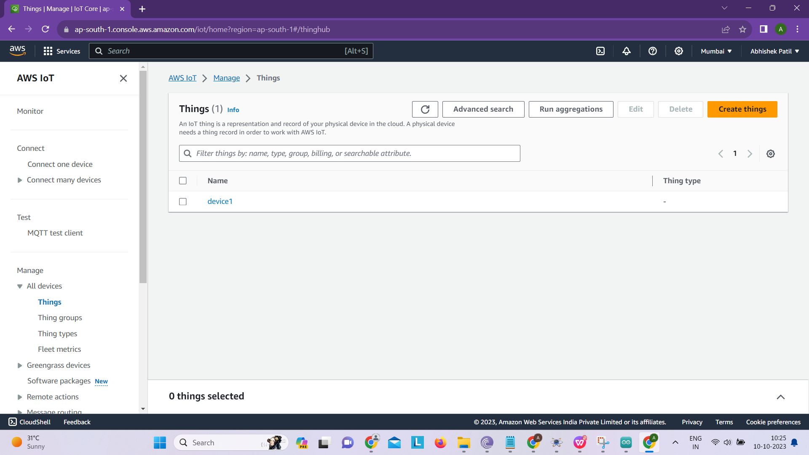
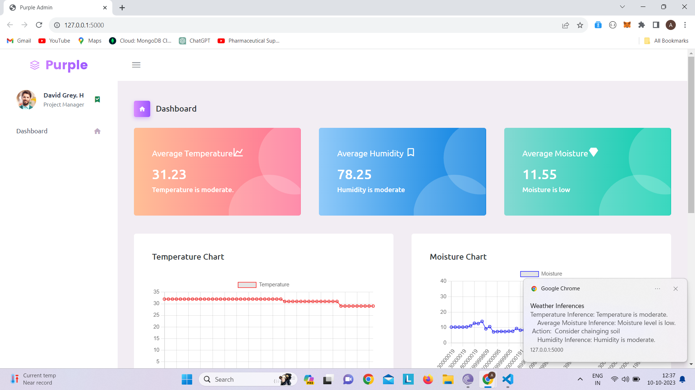
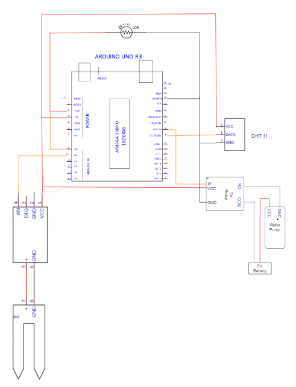
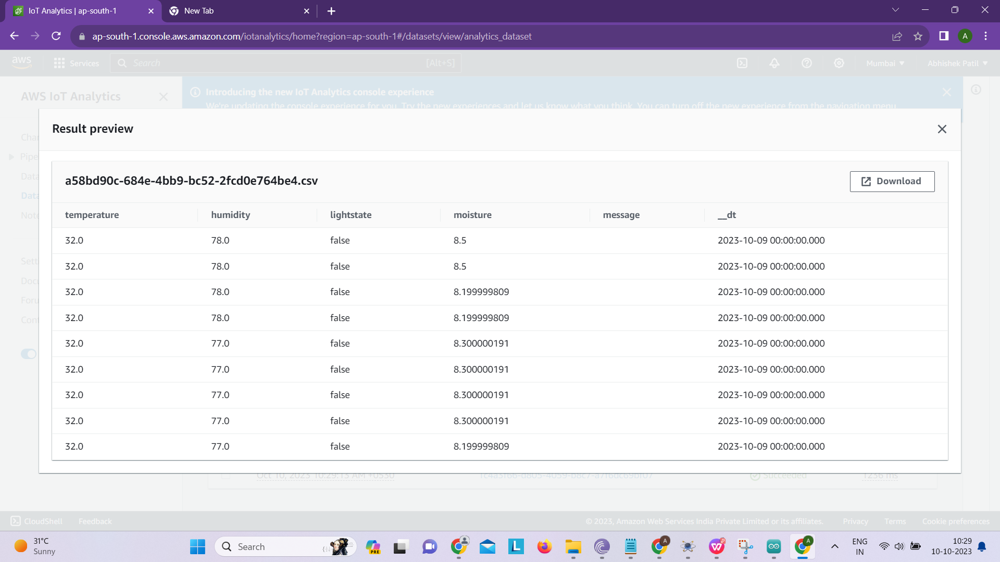
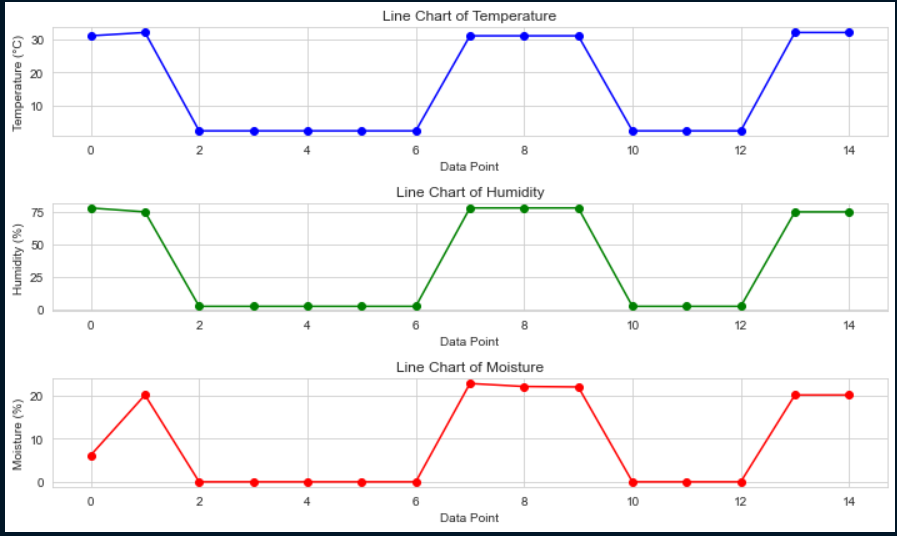

# Plant Monitoring System 🌱

The **Plant Monitoring System** is an IoT-based project designed to monitor and manage the environment for plants in real time. It leverages **AWS IoT**, cloud storage, and other AWS services to ensure a smart and efficient system. This project includes hardware integration, a cloud-based backend, and a user-friendly GUI to display data, control settings, and manage notifications.

## Features

- **IoT Integration**: Real-time monitoring of environmental parameters using sensors connected to AWS IoT.
- **AWS Services**: Data is processed and stored using AWS IoT Core, DynamoDB, and MQTT Broker.
- **Data Visualization**: Displays sensor data using graphs and charts for better insights.
- **Alerts & Notifications**: Sends notifications when conditions like soil moisture or temperature exceed thresholds.
- **User-Friendly GUI**: Provides an intuitive interface for monitoring and controlling the system.
## Screenshots

### AWS IoT Integration


### Notifications


### Circuit Diagram


### Data Outputs


### Final Outcome


## Technologies Used

### Hardware
- Sensors: Soil moisture sensor, temperature sensor, and humidity sensor
- Microcontroller: Arduino or Raspberry Pi

### Software
- **Backend**: Python for data processing
- **Frontend**: GUI built with HTML and CSS

### AWS Services
- **AWS IoT Core**: Manages communication between devices and the cloud.
- **AWS DynamoDB**: Stores sensor data for real-time and historical analysis.
- **AWS MessageBroker**: For the purpose of message broker

## How to Run Locally

1. Clone the repository:
   ```bash
   git clone https://github.com/Abhip32/Plant-Monitoring-System-IOE.git
   ```
2. Navigate to the project directory:
   ```bash
   cd Plant-Monitoring-System-IOE
   ```
3. Install the required Python libraries:
   ```bash
   pip install -r requirements.txt
   ```
4. Connect your hardware and upload the necessary Arduino/Raspberry Pi code.
5. Run the backend server:
   ```bash
   python main.py
   ```
